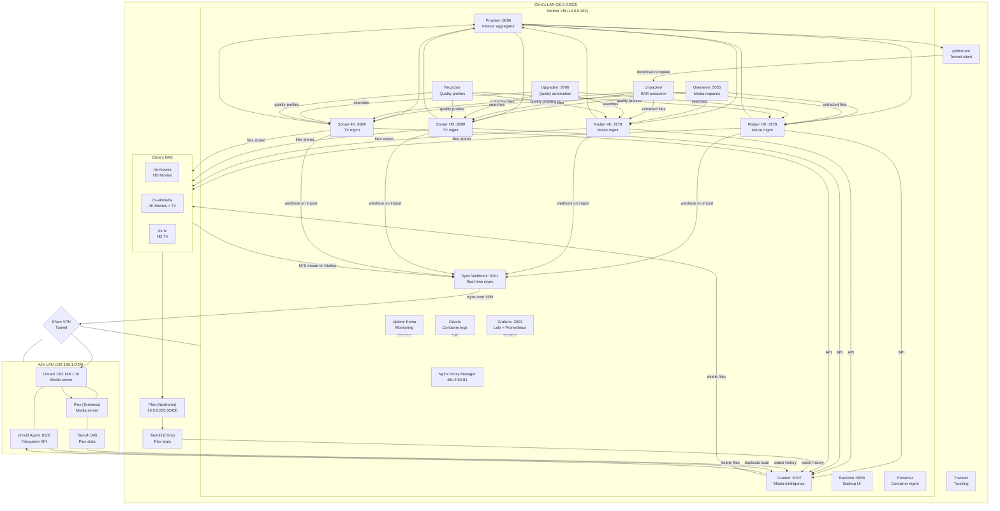

# Project Mother — Session Report (April 30, 2026)

Generated from conversation on 2026-04-30. Covers all changes made, bugs fixed, design decisions, security findings, and recommendations.

---

## Table of Contents

1. [Changes Deployed This Session](#1-changes-deployed-this-session)
2. [Bugs Fixed](#2-bugs-fixed)
3. [Upgraderr — Dashboard Rebuild & Rate Limiting](#3-upgraderr--dashboard-rebuild--rate-limiting)
4. [Sync-Webhook — Full GUI + Cancel/Rush](#4-sync-webhook--full-gui--cancelrush)
5. [Unpackerr Deployment](#5-unpackerr-deployment)
6. [Radarr-4K Downgrade Incident (Deadpool 2)](#6-radarr-4k-downgrade-incident-deadpool-2)
7. [Software & Security Audit](#7-software--security-audit)
8. [Workflow Design Gaps & Recommendations](#8-workflow-design-gaps--recommendations)
9. [Manual Import Error Cleanup Tools](#9-manual-import-error-cleanup-tools)
10. [System Architecture Diagram (Mermaid)](#10-system-architecture-diagram-mermaid)
11. [Current System Status](#11-current-system-status)
12. [Outstanding Actions & Recommendations](#12-outstanding-actions--recommendations)

---

## 1. Changes Deployed This Session

| Service | Change | Status |
|---|---|---|
| Upgraderr | Fixed stats bug: `upgrades_today` now queries `upgrade_history` not `daily_stats` | ✅ Live |
| Upgraderr | Fixed column name: `upgraded_at` → `imported_at` | ✅ Live |
| Upgraderr | Added 5-day rolling history table to dashboard | ✅ Live |
| Upgraderr | Added daily search cap (`max_searches_per_day` setting) | ✅ Live |
| Sync-Webhook | Full web GUI at `/ui` — Dashboard, Queue, History | ✅ Live |
| Sync-Webhook | Cancel pending jobs | ✅ Live |
| Sync-Webhook | Rush (priority promote) — moves job to front, releases extra semaphore slot | ✅ Live |
| Sync-Webhook | Fixed restart persistence: pending + in_progress jobs survive container restarts | ✅ Live |
| Sync-Webhook | History scanner timer bar on dashboard | ✅ Live |
| Unpackerr | New container `golift/unpackerr:0.15.2` — RAR extraction for all 4 *arr instances | ✅ Live |
| Radarr-4K | Moved 39 movies from wrong quality profile (UHD Bluray+WEB) → correct (Remux+WEB 2160p) | ✅ Done |
| CLAUDE.md | Updated docs table: replaced HUNTARR_SYNC_SETUP.md with WORKFLOW.md | ✅ Done |
| CLAUDE.md | Added DISABLE_MOVIE_SYNC sentinel file to conventions | ✅ Done |

---

## 2. Bugs Fixed

### 2a. Upgraderr Stats Always Showed Zero Upgrades

**Root cause**: `_db_increment_daily(upgrades=1)` was never called in the codebase. The `daily_stats.upgrades_found` column was always 0. Stats endpoint was reading from this broken column.

**Fix**: Changed both `api_stats()` and `dashboard()` routes to query `upgrade_history` directly:
```sql
SELECT COUNT(*) FROM upgrade_history WHERE date(imported_at) = date('now')
```

**Secondary bug**: Query used column `upgraded_at` which doesn't exist — actual column is `imported_at`. Fixed with `sed -i` replacing all occurrences.

**Correct data** (as of session end):
- Past 5 days upgrades: 53 / 104 / 180 / 128 / 2
- Total queue depth: 3,839 items across 6 tiers

---

### 2b. Sync-Webhook Lost Pending Jobs on Restart

**Root cause**: `recover_interrupted_jobs()` on startup was deleting all `pending` rows instead of re-queuing them. Only `in_progress` jobs were recovered.

**Fix**: Changed to re-queue both `pending` AND `in_progress` jobs on startup — marks them all `failed` then re-submits to the thread pool in the original order.

**Impact**: Any jobs that were waiting in queue (not yet running) at restart time are now preserved. The queue survives container restarts fully.

---

### 2c. Sync-Webhook Container Name Mangling After Force-Remove

**Cause**: D-state rsync processes (NFS I/O wait) block `docker stop`. After `docker rm -f`, compose recreates with a hash-prefixed name.

**Fix procedure** (requires sudo terminal access):
```bash
sudo kill -9 $(ps aux | grep rsync | grep -v grep | awk '{print $2}')
docker stop sync-webhook
docker compose up -d sync-webhook
```
If name is mangled: `docker rename <hash>_sync-webhook sync-webhook && docker start sync-webhook`

---

### 2d. Unpackerr Connecting to Wrong Internal Ports

**Cause**: Docker container-to-container communication uses internal ports, not host-mapped ports. `radarr-4k` listens on `:7878` internally (host maps to 7879). `sonarr-4k` listens on `:8989` internally (host maps to 8990).

**Fix**: Changed docker-compose.yml:
- `UN_RADARR_1_URL=http://radarr-4k:7878` (was 7879)
- `UN_SONARR_1_URL=http://sonarr-4k:8989` (was 8990)

---

## 3. Upgraderr — Dashboard Rebuild & Rate Limiting

### Stats Now Correct

The dashboard now shows:
- **Searches Today** with optional progress bar when cap is set
- **Upgrades Grabbed Today** from `upgrade_history` (accurate)
- **Items in Queue** (sum across all tiers)
- **Next Sweep** time

### 5-Day Rolling History Table

Added to dashboard — shows per-day searches and upgrades for the past 5 days with a bar chart column.

### Daily Search Cap

Added `max_searches_per_day` setting. When set > 0, sweep checks if today's search count has reached the cap and skips the sweep entirely if so.

**Recommendation**: Set this to **30–50** via Settings (`http://mother:9706/settings`). This gives ~210–350 searches/week, enough to process Tier 3 upgrades at a sustainable rate without overwhelming the sync-webhook queue.

**Current problem**: 350 upgrades in a few days with 184 sync jobs backlogged. At 50/day, you clear the backlog within ~4 days and keep pace going forward.

**To set**: Go to `http://mother:9706/settings` → find "Max Searches per Day" → enter `50` → Save.

---

## 4. Sync-Webhook — Full GUI + Cancel/Rush

### New UI at `http://mother:5001/ui`

Three pages:

**Dashboard** (`/ui`)
- 6 stat cards: Pending, Active, Done Today, Failed Today, Total Synced, Total Data
- History scanner bar: last ran time, next scheduled run, interval, manual trigger button
- Active syncs section
- Pending queue preview (top 10)
- Recent completed table
- Auto-refreshes every 30s when jobs are active

**Queue** (`/ui/queue`)
- Filter by status (active/failed/cancelled/all), type (movie/episode), search by title
- Sort on all columns
- **Rush button** (pending only): promotes job to priority=-1, releases an extra semaphore slot temporarily so it can jump ahead of running jobs
- **Cancel button** (pending only): marks job cancelled, skipped when the thread picks it up
- **Retry button** (failed only): resets job to pending

**History** (`/ui/history`)
- Filter and sort completed/failed/cancelled jobs
- Error message tooltip on failed rows
- Upgrade badge (↑) for upgrade-triggered syncs
- Duration column

### Job Persistence Design

| State | Survives restart? | How |
|---|---|---|
| `pending` | ✅ Yes | Re-queued in original order on startup |
| `in_progress` | ✅ Yes | Reset to pending, re-queued |
| `success` / `failed` / `cancelled` | ✅ Always (DB) | Terminal states, no action needed |

---

## 5. Unpackerr Deployment

**Container**: `golift/unpackerr:0.15.2`  
**Purpose**: Automatically extracts RAR/ZIP archives that torrent clients download, allowing Radarr/Sonarr to import the actual media file.

### Configuration

Polls all 4 *arr instances every 2 minutes:
- Radarr HD → `http://radarr-hd:7878` → `/downloads/radarr-hd`
- Radarr 4K → `http://radarr-4k:7878` → `/downloads/radarr-4k`
- Sonarr HD → `http://sonarr-hd:8989` → `/downloads/sonarr-hd`
- Sonarr 4K → `http://sonarr-4k:8989` → `/downloads/sonarr-4k`

### Key Settings

| Setting | Value | Notes |
|---|---|---|
| `UN_INTERVAL` | 2m | Polling frequency |
| `UN_DELETE_DELAY` | 5m | Wait after import before deleting archive |
| `UN_DELETE_ORIGINAL` | true | Deletes the original RAR files |
| `UN_DELETE_FILES` | true | Deletes extracted files that were imported |
| `UN_PARALLEL` | 1 | One extraction at a time (NFS-safe) |
| Protocols | torrent | Only processes torrent downloads |
| Webhook | Telegram | Notifications on extraction events |

### Verified Working

All 4 instances connected cleanly at startup:
```
[Radarr] Updated (http://radarr-hd:7878): 15 Items Queued, 15 Retrieved
[Radarr] Updated (http://radarr-4k:7878): 0 Items Queued, 0 Retrieved
[Sonarr] Updated (http://sonarr-hd:8989): 8 Items Queued, 8 Retrieved
[Sonarr] Updated (http://sonarr-4k:8989): 10 Items Queued, 10 Retrieved
```

---

## 6. Radarr-4K Downgrade Incident (Deadpool 2)

### What Happened

39 Radarr-4K movies were on the `UHD Bluray + WEB` quality profile (ID=7), which **blocks Remux-2160p** as the maximum allowed quality. These movies had Remux files that Radarr considered above the profile ceiling. After a recyclarr sync corrected the `until_quality` / `until_score` settings, Radarr-4K reprocessed these movies, saw the Remux files as "above quality ceiling," and began searching for replacements — downloading lower-quality WebDL versions.

### Root Cause

Recyclarr `until_quality` must be the profile's **maximum** quality (a ceiling), not a minimum. When the ceiling was below the existing Remux files, Radarr treated them as not matching any valid quality and searched for something within profile.

### Fix Applied

- Queried all 39 affected movies via Radarr API
- Moved all 39 to `Remux + WEB 2160p` profile (ID=8), which allows Remux-2160p
- Re-triggered search for Deadpool 2 specifically to get the Remux back
- Verified: all 39 movies now show profile ID=8

### Prevention

Recyclarr config (`configs/recyclarr/recyclarr.yml`) should be reviewed whenever quality profiles change. The key invariant: if you have Remux files in a library, those movies must be on a profile that includes Remux in its quality list.

---

## 7. Software & Security Audit

### 7a. Authentication & Access Control

| Service | Auth | Finding | Action |
|---|---|---|---|
| Upgraderr | JWT (bcrypt, 5/min rate limit) | ✅ Good | None |
| Curatorr | JWT dual-token (HttpOnly cookies, 1h access / 7d refresh) | ✅ Good | None |
| Sync-Webhook | None — "internal, no auth" | ⚠️ Acceptable for LAN-only | Add to NPM with IP allowlist if exposed externally |
| Radarr/Sonarr | API key + optional auth | ✅ Good — behind NPM | Verify NPM auth layer is enabled |
| Prowlarr | API key | ✅ Good | None |
| Portainer | Username/password | ✅ Good | Ensure strong password |
| Dozzle | No auth (log viewer) | ⚠️ LAN-only acceptable | Add auth if exposing via NPM |
| Uptime Kuma | Username/password | ✅ Good | None |
| Grafana | Username/password | ✅ Good | Ensure default admin password changed |
| Backrest | Username/password | ✅ Good | None |

**Recommendation**: All services exposed through Nginx Proxy Manager should have either application-level auth OR NPM's built-in access list (IP allowlist + HTTP basic auth). Do not expose Sync-Webhook or Dozzle externally without adding auth.

### 7b. Secrets Management

- All secrets in `.env` — correct approach for a homelab
- `.env` is in `.gitignore` — ✅ not committed
- `.env.example` exists with placeholder values — ✅ good for documentation
- Telegram bot token is embedded in Unpackerr webhook URL in docker-compose.yml env var — this is fine since the file is not committed and tokens in compose env vars are not exposed in container metadata

**Finding**: No hardcoded secrets found in any committed code. Bot tokens and API keys all sourced from `.env`.

### 7c. Network Exposure

- All services on `mother_network` bridge — containers can reach each other by name
- NFS mounts from Synology NAS: read-write — appropriate for media sync
- CIFS mount from Unraid (`/mnt/unraid/media`): read-write — necessary for sync destination
- IPsec VPN to Ali's LAN: only needed services should traverse it (Unraid Agent at 192.168.1.10:8100)
- Nginx Proxy Manager handles external SSL termination — ✅

**Recommendation**: Ensure NPM is not exposing Radarr/Sonarr directly to the internet — they should be behind auth. Use NPM's "Access Lists" feature to restrict to known IPs where possible.

### 7d. Container Security

| Finding | Severity | Status |
|---|---|---|
| Most containers run as non-root (`PUID`/`PGID`) | ✅ Good | — |
| Unpackerr runs as `${PUID}:${PGID}` | ✅ Good | — |
| No `privileged: true` containers observed | ✅ Good | — |
| No `--cap-add` beyond defaults | ✅ Good | — |
| Volumes are specific paths, not `/` or `/var` | ✅ Good | — |
| Restart policies: `unless-stopped` (not `always`) | ✅ Good | Allows manual stop |

### 7e. Database Security

- Curatorr: FastAPI + aiosqlite (WAL mode, 60s timeout) — ✅
- Sync-Webhook: Flask + sqlite3 (WAL mode) — ✅
- Upgraderr: Flask + sqlite3 (WAL mode) — ✅
- Curatorr and Upgraderr use parameterized queries — ✅ no SQL injection risk
- DB files in `/opt/mother/data/` with appropriate permissions

### 7f. API Key Rotation Reminder

API keys are long-lived. Consider rotating Radarr/Sonarr/Prowlarr API keys periodically (every 6-12 months) and updating `.env`. No automated rotation is implemented.

### 7g. Recyclarr Configuration Review

The recyclarr config at `configs/recyclarr/recyclarr.yml` applies quality profiles across all 4 *arr instances. Key rules:
- `until_quality` must be the **maximum** quality in the profile (ceiling, not floor)
- `until_score: -9999` blocks all items below the cutoff score
- HD profiles block 720p/SD — correct per sync strategy
- 4K profiles allow Remux — correct after incident fix

**Action**: After any recyclarr changes, check Radarr/Sonarr Activity tab for unexpected "searching" behavior within 30 minutes.

---

## 8. Workflow Design Gaps & Recommendations

### 8a. Identified Gaps

| Gap | Impact | Recommendation |
|---|---|---|
| No Sonarr webhook → sync-webhook for TV | New TV episodes not synced in real-time | Verify Sonarr HD/4K both have webhook configured to `http://sync-webhook:5001/sync/sonarr` |
| Upgraderr sweep rate uncapped | 350 upgrades in 3 days, 184 sync backlog | Set `max_searches_per_day=50` immediately |
| No alerting on sync-webhook queue depth | Backlog of 184 jobs went unnoticed | Add queue depth check to daily report |
| Unpackerr was absent | Compressed downloads couldn't be imported | ✅ Fixed this session |
| Radarr-4K profile mismatch | Caused autonomous downgrades | ✅ Fixed this session |
| Manual import errors accumulate | Radarr/Sonarr Activity piles up | See Section 9 |

### 8b. Pipeline Correctness (All Good)

The core sync strategy is sound:
1. Upgraderr detects suboptimal quality on Chris's side
2. Radarr/Sonarr downloads better version
3. Webhook fires → sync-webhook queues rsync → file copied to Ali's Unraid
4. OR: history scanner picks it up within 48h if webhook missed

The 720p/x265-no-HDR exclusion from sync is correct and intentional — Upgraderr handles upgrades first.

### 8c. Observability

The Loki + Grafana + Prometheus stack (deployed 2026-04-14) provides:
- Container metrics via cAdvisor
- System metrics via node-exporter
- Log aggregation via Promtail
- Dashboards at `http://mother:3003`

**Recommendation**: Create a Grafana dashboard for Upgraderr queue depth and sync-webhook backlog trends. Both services expose their stats via API.

---

## 9. Manual Import Error Cleanup Tools

### The Problem

Radarr/Sonarr sometimes show errors like:
> "Found matching movie via grab history, but release was matched to movie by ID. Manual Import required."

These accumulate when a torrent download completed but the import path changed (rename, move, upgrade).

### Options Evaluated

| Tool | Purpose | Verdict |
|---|---|---|
| **Decluttarr** (GitHub: ManiMatter/decluttarr) | Removes stalled/broken queue items automatically | ✅ Recommended — Docker, active project |
| ArrStalledHandler | Similar queue cleanup | Less mature |
| Custom PyArr script | Full control via API | Best for one-time cleanup |

### Decluttarr (Recommended)

Decluttarr monitors Radarr/Sonarr queues and removes:
- Stalled downloads (no progress for configurable time)
- Downloads with "Manual Import Required" errors
- Duplicate grabs
- Items with no files found

```yaml
# Add to docker-compose.yml
decluttarr:
  image: ghcr.io/manimatter/decluttarr:latest
  container_name: decluttarr
  restart: unless-stopped
  environment:
    - TZ=${TZ}
    - LOG_LEVEL=INFO
    - RADARR_URL=http://radarr-hd:7878
    - RADARR_KEY=${RADARR_HD_API_KEY}
    - SONARR_URL=http://sonarr-hd:8989
    - SONARR_KEY=${SONARR_HD_API_KEY}
    - REMOVE_STALLED=true
    - REMOVE_FAILED=false
    - REMOVE_METADATA_MISSING=false
    - REMOVE_MISSING_FILES=true
    - MIN_DOWNLOAD_SPEED=0
    - PERMITTED_ATTEMPTS=3
    - NO_STALLED_REMOVAL_QBIT_TAG=Don't Kill
    - FAILED_IMPORT_MESSAGE_PATTERNS=["Manual Import","matched to movie by ID"]
  networks:
    - mother_network
```

**Note**: Run in "dry mode" first to see what it would remove before enabling live removals. Check Decluttarr docs for current environment variable names as they may have changed.

### Quick One-Time Cleanup (Python)

For immediate cleanup without a new service:
```bash
# Check what's in the queue with import errors
curl -s "http://localhost:7878/api/v3/queue?page=1&pageSize=200&includeUnknownMovieItems=true" \
  -H "X-Api-Key: $(grep RADARR_HD_API_KEY /opt/mother/.env | cut -d= -f2)" \
  | python3 -m json.tool | grep -A2 "Manual Import"
```

---

## 10. System Architecture Diagram (Mermaid)

Copy this into any Mermaid renderer (e.g., mermaid.live, Obsidian, GitLab/GitHub) to view the diagram.



### Component Descriptions

| Component | Port | Role |
|---|---|---|
| **Radarr HD** | 7878 | Manages HD movie library on Chris's NAS. Handles search, download, import, quality profiles. |
| **Radarr 4K** | 7879 | Same as HD but for 4K/Remux movies. |
| **Sonarr HD** | 8989 | TV show management for HD library. |
| **Sonarr 4K** | 8990 | TV show management for 4K library. |
| **Prowlarr** | 9696 | Aggregates all torrent/Usenet indexers. Single point of indexer configuration for all 4 *arr instances. |
| **Recyclarr** | — | Syncs TRaSH Guides quality profiles and custom formats into Radarr/Sonarr. Runs on schedule. |
| **Upgraderr** | 9706 | Custom quality automation. Scans libraries every 30min, classifies items into 6 upgrade tiers, triggers searches. Replaces Huntarr. |
| **Unpackerr** | — | Polls *arr download queues. When a torrent contains RARs, extracts them so *arr can import the media file. Deletes archives after import. |
| **Sync-Webhook** | 5001 | Receives *arr webhooks on download/import events. Queues rsync jobs to copy files to Ali's Unraid over VPN. Includes history scanner fallback, stall watchdog, retry logic. |
| **Curatorr** | 9707 | Media intelligence dashboard. Browse full library, composite scores (IMDb/RT/Metacritic), purge analysis, watch history, rules engine, duplicate scanner, direct deletion. |
| **Overseerr** | 5055 | Media request portal. Both users submit requests here → auto-approved → sent to Radarr/Sonarr. |
| **Unraid Agent** | 8100 | Lightweight FastAPI on Ali's Unraid. Scans local filesystem for duplicates (fast, avoids CIFS from Mother). Called by Curatorr. |
| **Nginx Proxy Manager** | 80/443/81 | Reverse proxy with SSL termination. All external-facing services route through here. |
| **Grafana + Loki + Prometheus** | 3003 | Full observability stack. Metrics from cAdvisor + node-exporter, logs from Promtail, dashboards in Grafana. |
| **Uptime Kuma** | — | Service health monitoring with alerts. |
| **Backrest** | 9898 | Restic backup web UI. Manages backups of critical data directories. |
| **Dozzle** | — | Real-time Docker container log viewer. |
| **Portainer** | — | Docker container management UI. |
| **Trackarr** | — | Media tracking service. |
| **Apprise** | — | Notification aggregator (Telegram, etc.). |

---

## 11. Current System Status

As of session end (2026-04-30 ~21:00 EST):

### Container Health
All 29 containers running. Key ones:
- `upgraderr` — Up, healthy
- `sync-webhook` — Up 2 days, healthy
- `unpackerr` — Up, no errors
- `curatorr` — Up 5 days, healthy
- `radarr-hd/4k`, `sonarr-hd/4k` — Up 4 days

### Upgraderr Queue (3,839 total pending)
| Tier | Description | Count |
|---|---|---|
| T1 | m2ts / BDMV container | 85 |
| T2 | Non-MKV container | 305 |
| T3 | 720p or lower | 1,168 |
| T4 | BluRay source available | 660 |
| T5 | No surround audio | 1,602 |
| T6 | Low TRaSH score | 19 |

**T3 (720p) at 1,168 items is the priority.** Consider disabling T4–T6 in Settings until T3 is cleared.

### Upgraderr Activity (Past 5 Days)
| Date | Searches | Upgrades Grabbed |
|---|---|---|
| 2026-04-27 | 175 | 53 |
| 2026-04-28 | 185 | 104 |
| 2026-04-29 | 155 | 180 |
| 2026-04-30 | 5 | 128 |
| 2026-05-01 | 0 | 2 |

### Sync-Webhook Stats
- Total synced: 6,415 successful jobs
- Total data transferred: 1.0 TB
- Total failed (all time): 1,601 (most are old stale entries, pre-fix)
- Today: 0 active jobs

---

## 12. Outstanding Actions & Recommendations

### Immediate (Do Now)

- [ ] **Set Upgraderr daily cap**: Go to `http://mother:9706/settings` → set `Max Searches per Day` to `50`. This prevents the sync backlog from growing further.
- [ ] **Disable Upgraderr T4–T6**: Go to Settings → Instances → uncheck Tier 4, 5, 6 per instance. Focus search budget on T3 (720p) and T1/T2 (bad containers) until queue drops.
- [ ] **Verify Sonarr webhooks**: In Sonarr HD and Sonarr 4K, check Settings → Connect → confirm a webhook connection pointing to `http://sync-webhook:5001/sync/sonarr` is enabled.
- [ ] **Change Grafana default password**: Go to `http://mother:3003` → Profile → Change Password if still using default `admin/admin`.

### Short Term (This Week)

- [ ] **Consider adding Decluttarr**: Automates cleanup of "Manual Import Required" errors in Radarr/Sonarr. See Section 9 for docker-compose snippet.
- [ ] **Add queue depth to daily report**: Edit `reports/daily_report.py` to include sync-webhook pending count and Upgraderr queue total from their APIs.
- [ ] **NPM auth for internal tools**: Add Access Lists in NPM for Dozzle and Sync-Webhook UI if accessible externally.

### Ongoing

- Monitor Upgraderr T3 drain rate. At 50 searches/day with ~50% grab rate, expect to clear T3 in ~46 days.
- After T3 clears, re-enable T4–T6 and increase cap if sync backlog stays manageable.
- Review Recyclarr config changes in a staging environment before applying — the Deadpool 2 incident showed that profile changes have immediate side effects.
